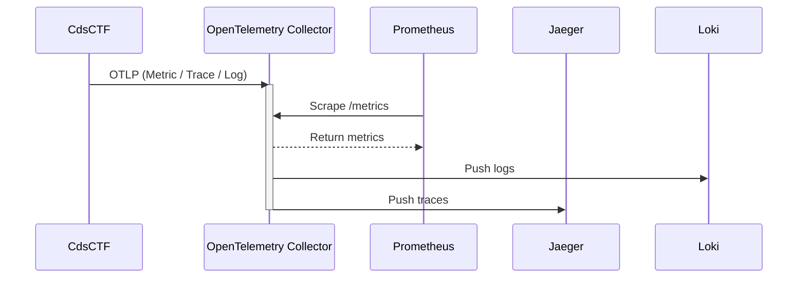

# Observability

CdsCTF uses the **OpenTelemetry SDK** to collect metrics, traces, and logs, and sends this data to an OpenTelemetry Collector via the **OTLP** protocol. The Collector then forwards data to backends (e.g. Prometheus, Jaeger, Loki) according to its configuration, providing observability.

> [!TIP] Why observability?
>
> For a CTF platform, observability helps monitor application health, persist and query logs (e.g. with Loki), and perform distributed tracing (e.g. with Jaeger), making debugging and operations easier.

This section explains **principles only**; it does not cover how to deploy the Collector or backends.

## Data flow and roles

Observability typically involves three kinds of data:

| Type | Description | Typical backends |
|------|-------------|------------------|
| **Metric** | Counters, gauges, histograms (e.g. request count, latency) | Prometheus |
| **Trace** | Distributed traces (request flow across services) | Jaeger |
| **Log** | Application logs | Loki |

CdsCTF acts as the **data source**, sending all three via OTLP to a Collector. The **OpenTelemetry Collector** sits in the middle: it receives OTLP, optionally batches or transforms data, and exports to backends. The usual pattern differs for metrics vs traces/logs:

- **Metrics**: The backend (e.g. Prometheus) **pulls** from an endpoint exposed by the Collector (e.g. `/metrics`).
- **Traces / Logs**: The Collector **pushes** to the backend (e.g. Jaeger, Loki).

The flow can be summarized as:

- **CdsCTF → Collector**: The in-process OpenTelemetry SDK sends metrics, traces, and logs over OTLP (gRPC or HTTP) to the Collector’s receiver (e.g. ports 4317 / 4318).
- **Collector → backends**: The Collector’s pipeline configuration determines how data is exported (e.g. metrics exposed for Prometheus scrape, traces to Jaeger, logs to Loki).

To use observability, you need to deploy and configure a Collector and your chosen backends. On the CdsCTF side, enable OTLP export and set the Collector’s OTLP endpoint in config. See [Configuration](../deployment/config#observe) for the relevant options.
