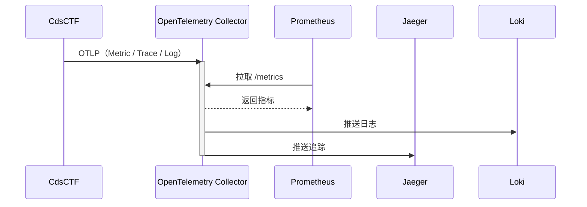

# 可观测性

CdsCTF 通过 **OpenTelemetry SDK** 采集指标（Metric）、追踪（Trace）与日志（Log），并使用 **OTLP** 协议将数据发送到 OpenTelemetry Collector。Collector 再根据配置将数据转发到不同后端（如 Prometheus、Jaeger、Loki），从而实现可观测性。

> [!NOTE]
> 可观测性设施（如 OpenTelemetry Collector）**不随** Docker Compose 或 Helm Chart 提供，需自行部署。

> [!TIP] 为什么需要可观测性？
>
> 对 CTF 平台而言，可观测性有助于监控应用状态、配合 Loki 等做日志持久化与检索、配合 Jaeger 等做分布式追踪，便于排障与运维。

下文仅说明 **原理**，不涉及 Collector 或后端的部署方式。

## 数据流与角色

可观测性通常包含三类数据：

| 类型 | 说明 | 常见后端 |
|------|------|----------|
| **Metric** | 指标（如请求数、延迟分位数） | Prometheus |
| **Trace** | 分布式追踪（请求在各服务间的调用链） | Jaeger |
| **Log** | 应用日志 | Loki |

CdsCTF 作为**数据源**，只负责通过 OTLP 把三类数据发到 Collector。**OpenTelemetry Collector** 作为中间层，负责接收 OTLP、可选地做批处理或转换，再分发给不同后端。Metric 与 Trace/Log 的常见模式不同：

- **Metric**：多由后端（如 Prometheus）**主动拉取** Collector 暴露的指标接口（例如 `/metrics`）。
- **Trace / Log**：多由 Collector **主动推送**到后端（如 Jaeger、Loki）。

数据流可概括为：

- **CdsCTF → Collector**：应用内 OpenTelemetry SDK 通过 OTLP（gRPC 或 HTTP）将 Metric、Trace、Log 发送到 Collector 的接收端（如 4317 / 4318 端口）。
- **Collector → 后端**：Collector 的 pipeline 配置决定数据如何转发（例如 Metric 暴露给 Prometheus 拉取，Trace 推送到 Jaeger，Log 推送到 Loki）。

因此，若希望使用可观测性，需要部署并配置好 Collector 及相应后端；CdsCTF 端只需在配置中开启 OTLP 导出并填写 Collector 的 OTLP 端点即可。配置项说明见 [配置文件](../deployment/config#observe)。
